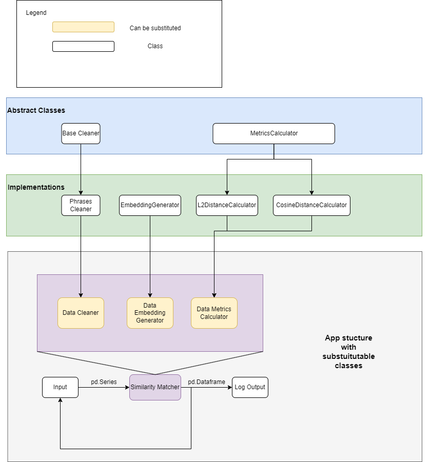

Project Plan:
- [X] Create a structure for the project: create a unified eay of running the scripts and the app from the command line
- [X] Implement the loaders in an abstract way taking into consideration that the source of data might change
- [X] Implement a one time script for loading the data and cleaning the embedded dataset: cleaning step
- [X] Implement the processing classes: embedder, 
- [X] Implement the processing classes: metrics calculator, 
- [X] Implement the processing classes: similarity finder
- [X] Implement the user input processor
- [X] Implement the app for allowing the app to calculate the match on the fly
- [X] Documentation diagram, simple instruction on how to execute the project
- [ ] Implement the tests for the processing classes using pytest (to be done)
- [ ] Implement a better matcher: optimize the Levenstein method to be usable (to be done)
- [ ] Dockerize
- [ ] Parallelize

- The whole diagram of the project can be found here:

To run the project you need to choose from the following run configurations (the order is important):
- load_embeddings: ex. "-p load_embeddings -bin 'data/binary.bin'"
- calculate_file_similarity: ex. "-p calculate_file_similarity"
- run_app: ex. "-p run_app" (it also has a list of configurable parameters for changing the paths)

The parameters can be found in config/config.toml.

The application can be run in two modes:
- By providing the maunally inputted phrases:
  - The input string should start with "manual:"
- By providing a path to CSV or Parquet:
  - The input string should start with "file:"