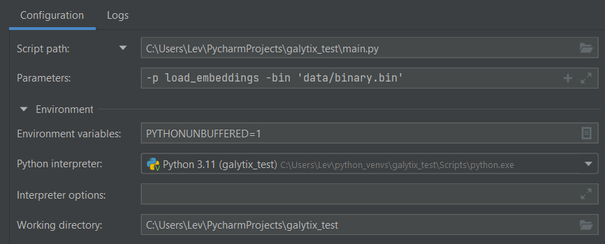
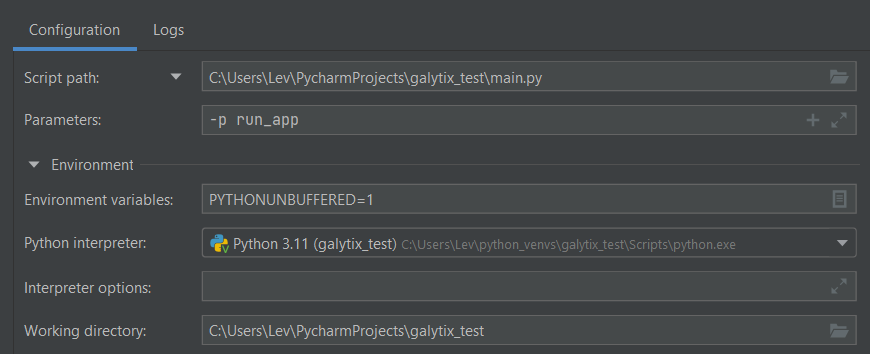

# Implementation overview
## Project plan
- [X] Create a structure for the project: create a unified eay of running the scripts and the app from the command line
- [X] Implement the loaders in an abstract way taking into consideration that the source of data might change
- [X] Implement a one time script for loading the data and cleaning the embedded dataset: cleaning step
- [X] Implement the processing classes: embedder, 
- [X] Implement the processing classes: metrics calculator, 
- [X] Implement the processing classes: similarity finder
- [X] Implement the user input processor
- [X] Implement the app for allowing the app to calculate the match on the fly
- [X] Documentation diagram, simple instruction on how to execute the project
- [ ] Implement the tests for the processing classes using pytest (to be done)
- [ ] Implement a better matcher: optimize the Levenstein method to be usable (to be done)
- [ ] Dockerize
- [ ] Parallelize

## Run configuration
The idea is to make running of all python modules within the project through with one standardized approach.
Therefore, the project has one global main that is responsible for parsing the command line arguments and executing
code in each corresponding local main. This way, we don't have to run each local main separately. Note that the 
working directory for each part of the project is set up strictly to the root of the project. All other paths are relative
The arguments for each local subprojects as well as the paths to each local main are defined in the config.toml file.

Inside the toml file, you can see three running configurations predefined for the project. They are following:
- load_embeddings: ex. "-p load_embeddings -bin 'data/binary.bin'"
- calculate_file_similarity: ex. "-p calculate_file_similarity"
- run_app: ex. "-p run_app" (it also has a list of configurable parameters for changing the paths)

To set up the correct application execution, we need to:
1) Run the `load_embeddings` run configuration to extract the embeddings from the binary file and store them in the
`data` folder. This is a one time script to set up the model embeddings. 

The command to run it:
   `python -p load_embeddings -bin 'data/binary.bin'`
Pycharm configuration:

2) After this, we can run the application by executing the `run_app` run configuration. It initializes all the required
app components and waits for the user input. The user input can be in the form of a terminal input string, or path to a
file. Upon running, we can manipulate the application running modes by:
   - By providing the manually inputted phrases (put the phrase after the prefix):
     - The input string should start with "_manual:_"
   - By providing a path to CSV or Parquet (put the path after the prefix):
     - The input string should start with "_file:_"

Examples: 
- `manual:how company compares to its peers?`
- `file:data/testing_phrases.csv`

The terminal command to initialize the app:
   `-p run_app`

The initial step of loading the embeddings can be also in the future incorporated into the first run of the application, 
during the startup.

Note that all the files used in the project are stored in the root, in the `data/` folder

## Documentation
In the project, I focused on implementing the modular classes that can be easily substituted as they have the same
set of methods. I tried to follow the dependency injection design pattern. This approach makes the application loose, as 
we may configure the behavior of the application by inserting into the driver class different interchangeable implementations.
I tried to give an example of how the approach can work by providing alternative implementations of the metrics calculation
and data loaders. As the logic becomes more and more complex, the modular approach becomes more and more relevant.

The whole diagram of the project can be found here:

From the diagram it can be seen that the Similarity Matcher class is used as a driver class
that is running the standard methods of the abstract data cleaning and metrics calculating classes.

On the diagram you also can see that the application is running in a constant loop. I chose
communication with the user over terminal and file inputs for the sake of simplicity. We could 
use an API that would accept get requests. 

As for the data processing part, I inserted the processing of the binary embeddings into the script 
that is supposed to be run first. I tried removing the stopwords, but then there were more
words in the phrases that were missing. I also tried the Levenstein approach, but it needs
to be efficient enough to work properly. I didn't have enough time to optimize it, so it could be a good addition
that would increase the quality of the matching.

First part of the implementation, I spent some time on organizing the structure of the OOP part of the project as well 
as the scripts.